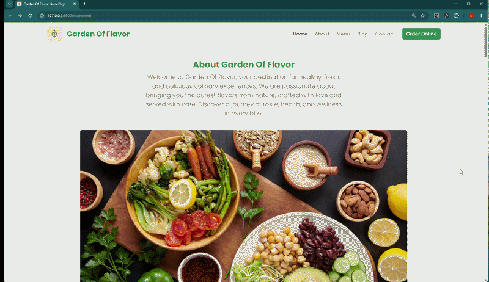

# 🌿 Garden Of Flavor

A modern and responsive restaurant web application built with HTML, CSS, JavaScript, and Bootstrap. Browse the menu, filter by category, and view detailed product pages.

##  Features

-  Dynamic menu rendering from a local JSON API
-  Category filtering (All, Breakfast, Lunch, Shakes)
-  Detail page for each menu item
-  Loading spinner while data is being fetched
-  Not Found page for invalid product IDs
-  Fully responsive design with Bootstrap
-  About section with image carousel
-  Contact form with address, email and phone info
-  Footer with quick links and social media icons

##  Technologies Used

- HTML5
- CSS3
- JavaScript (ES6+, Modules, Async/Await)
- Bootstrap 5
- Bootstrap Icons
- JSON Server (db.json as mock API)

## 📁 Project Structure

```
garden_of_flavor/
├── assets/
├── js/
│   ├── main.js
│   ├── api.js
│   └── ui.js
├── index.html
├── detail.html
├── style.css
├── db.json
└── README.md
```

